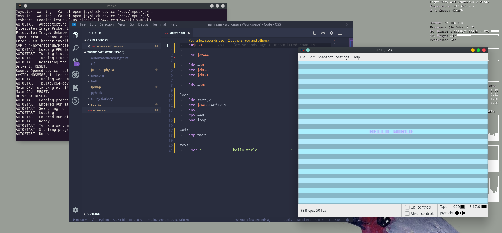

# c64

_Repository for learning 6502 assembly on the Commodore 64_

## Development Environment
- Install [VICE](http://vice-emu.sourceforge.net/vice_toc.html)
- Clone [c64-devkit](https://github.com/cliffordcarnmo/c64-devkit)
- Symlink `c64-devkit/emulator/linux/x64` to `/usr/local/bin/x64`
- Run `make` in `c64-devkit/` to compile and automatically run
 `main.asm` in `source/`

## Resources:
- [VICE emulator](http://vice-emu.sourceforge.net/vice_toc.html)
- [c64-devkit](https://github.com/cliffordcarnmo/c64-devkit)
- [easy6502](https://skilldrick.github.io/easy6502/)
- [dustlayer](https://dustlayer.com/tutorials)
- [Book on C64 assembly](http://69.60.118.202/books/commodore/books/Machine_Language_for_the_Commodore_Revised_and_Expanded_Edition.zip)
